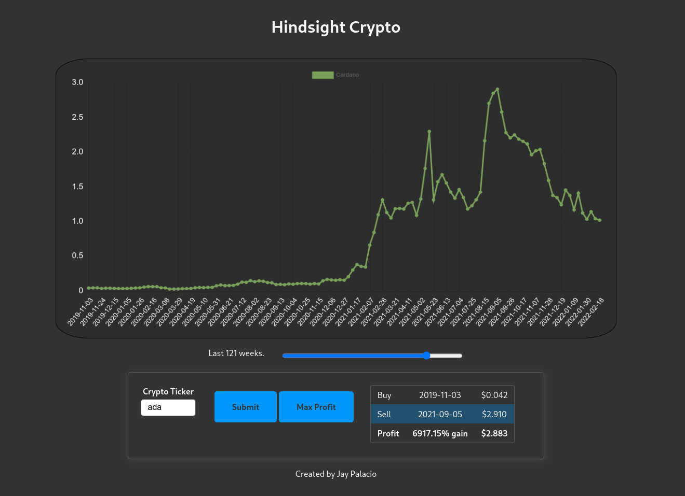

<h1 align='center'> Hindsight Crypto Profits </h1>

## [Click here to see deployed version](https://devpalacio.github.io/crypto-prices-frontend/)

### Hindsight crypto uses AlphaVantage API to implement the 'best time to buy a stock' dynamic programming algorithm.

#### Data Flow:
- BTC loads by default with 52 week window and gets put in localstorage.
- User enters crypto ticker hits submit.
- If ticker is in localstorage, apiData variable is updated, if not, api request is made
- apiData is transformed to be easily parsed by Chart.js and displayed
- If you want to feel FOMO, click 'Max Profit' and data from algorithm will populate.
